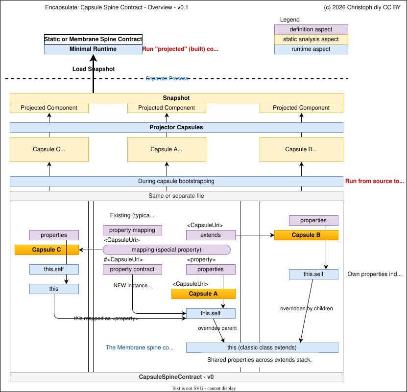

⚠️ **Disclaimer:** Under active development. Code has not been audited, APIs and interfaces are subject to change.

Capsule Spine Contract v0
===

The first *experimental* spine contract implementation used to incubate the spine approach.

A spine contract is a standard and implementation that governs:

- how capsule properties are mapped to the encapsulated api and
- which features are available to bind additional logic controlled by definitions declared in the capsule source

Spine contracts define ecosystems as source code is written against these standards. They define the fundamental logic of how components and their internal APIs are bound.

In practice there should only ever be very few spine contracts but there can be a plethora of different partial or full implementations of the same standard.

This spine contract aims to realize a concrete implementation of the [PrivateData.Space](https://privatedata.space/) model for the purpose of building full-stack distributed JavaScript applications & systems.




Example Capsule Source
---

```ts
// A capsule is defined by calling encapsulate() with a definition object and options.
// The definition is keyed by spine contract URI, then by property contract URI, then by property name.

const userService = await encapsulate({
    '#@stream44.studio/encapsulate/spine-contracts/CapsuleSpineContract.v0': {

        // Property struct marker — attaches Capsule metadata (capsuleName, capsuleSourceLineRef, etc.)
        '#@stream44.studio/encapsulate/structs/Capsule': {},

        // External struct via property contract delegate — maps a separate capsule as a struct.
        // 'as' aliases the full URI to a short name accessible on the API and via this.
        // 'options' are forwarded to the struct capsule's '#' property contract as overrides.
        '#./structs/Schema.v0': {
            as: '$schema',
            options: {
                '#': { schemaValue: { type: 'user', version: 2 } }
            }
        },

        // '#' is the default property contract — properties here are exposed directly on the capsule API.
        '#': {

            // --- Value Properties ---

            // Literal: a value property. Accessible on the API and via this. Can be overridden at runtime.
            name: {
                type: CapsulePropertyTypes.Literal,
                value: 'default-name'
            },

            // String: alias for Literal (semantic hint for string values).
            label: {
                type: CapsulePropertyTypes.String,
                value: undefined
            },

            // Constant: read-only value. Throws on assignment via the Membrane contract.
            VERSION: {
                type: CapsulePropertyTypes.Constant,
                value: '1.0.0'
            },

            // --- Function Properties ---

            // Function: bound to a self proxy. Receives arguments. Callable on the API.
            greet: {
                type: CapsulePropertyTypes.Function,
                value: function (this: any, greeting: string): string {
                    // 'this' is a proxy over the shared self — accesses all properties
                    // including those from extended capsules and overrides.
                    return `${greeting}, ${this.name}! (v${this.VERSION})`
                }
            },

            // GetterFunction: lazily evaluated when the property is accessed (no parentheses).
            fullLabel: {
                type: CapsulePropertyTypes.GetterFunction,
                value: function (this: any): string {
                    return `${this.label} [${this.name}]`
                }
            },

            // SetterFunction: called when the property is assigned to. Enables validation/transformation.
            setName: {
                type: CapsulePropertyTypes.SetterFunction,
                value: function (this: any, newName: string) {
                    if (!newName) throw new Error('Name cannot be empty')
                    this.name = newName.trim()
                }
            },

            // Memoize: caches the return value. true = permanent, number = TTL in ms.
            expensiveComputation: {
                type: CapsulePropertyTypes.GetterFunction,
                value: function (this: any): object {
                    return { computed: true, name: this.name }
                },
                memoize: true          // cached permanently for this run
            },
            timedCache: {
                type: CapsulePropertyTypes.Function,
                value: function (this: any): object {
                    return { ts: Date.now(), name: this.name }
                },
                memoize: 5000           // cache expires after 5 seconds
            },

            // --- Mapping Properties ---

            // Mapping (capsule reference): composes another capsule as a sub-component.
            // The mapped capsule gets its own instance with its own self context.
            $auth: {
                type: CapsulePropertyTypes.Mapping,
                value: authCapsule,     // direct capsule reference
                options: {              // static options object forwarded to the mapped capsule
                    '#': { realm: 'users' }
                }
            },

            // Mapping (string URI): resolved relative to this capsule's module filepath.
            $db: {
                type: CapsulePropertyTypes.Mapping,
                value: './Database.v0', // resolved via spine contract's resolve + importCapsule
                options: async ({ self, constants }: { self: any, constants: any }) => {
                    // Dynamic options function — receives { self, constants }.
                    // 'constants' contains Literal/String values from the mapped capsule.
                    // 'self' contains resolved sibling mappings when depends is declared.
                    return {
                        '#': { connectionString: `db://${constants.dbName}` },
                        // Nested capsule-name-targeted options: keys without '#' prefix
                        // are matched against capsule names deeper in the mapping tree.
                        'connectionPool': {
                            '#': { maxConnections: 10 }
                        }
                    }
                }
            },

            // Mapping with depends: declares sibling dependencies that must resolve first.
            // options({ self }) receives the parent capsule's self with resolved siblings.
            // The static analyzer can auto-detect self.<name> references and inject depends.
            $api: {
                type: CapsulePropertyTypes.Mapping,
                value: apiCapsule,
                depends: ['$auth'],     // explicit depends — ensures $auth is resolved first
                options: function ({ self }: { self: any }) {
                    return {
                        '#': {
                            authRealm: self.$auth.realm,
                            capsuleName: self['#@stream44.studio/encapsulate/structs/Capsule'].capsuleName
                        }
                    }
                }
            },

            // --- Lifecycle Properties ---

            // StructInit: runs once after instantiation, before the handler. For struct capsules.
            // Fires top-down through the extends chain. Not exposed on the API.
            Init: {
                type: CapsulePropertyTypes.StructInit,
                value: async function (this: any) {
                    this.ready = true
                }
            },

            // Dispose: runs after the handler completes for. For struct capsules. Reverse order (bottom-up). Not on API.
            Dispose: {
                type: CapsulePropertyTypes.StructDispose,
                value: async function (this: any) {
                    this.ready = true
                }
            },

            // Init: like StructInit but for non-struct capsules (those without StructInit).
            Init: {
                type: CapsulePropertyTypes.Init,
                value: false
            },

            // Dispose: runs after the handler completes (those without StructInit). Reverse order (bottom-up). Not on API.
            Dispose: {
                type: CapsulePropertyTypes.Dispose,
                value: async function (this: any) {
                    this.ready = false
                }
            },

            // --- this.self ---
            // Inside any function, 'this' resolves the full merged context (child + parent).
            // 'this.self' resolves only the current capsule's own properties (ownSelf).
            // Useful in parent capsules to distinguish own values from child overrides.
            getOwnName: {
                type: CapsulePropertyTypes.GetterFunction,
                value: function (this: any): string {
                    return this.self.name   // own capsule's name, not child's override
                }
            }
        }
    }
}, {
    importMeta: import.meta,
    importStack: makeImportStack(),
    capsuleName: 'UserService',             // optional name — enables override targeting by name
    extendsCapsule: baseCapsule,            // inherits properties from another capsule (reference or string URI)
    ambientReferences: { authCapsule, apiCapsule } // capsules referenced in the definition that need CST tracking
})
```


Reference
---

### Capsule Definition Structure

```
{
    '<spineContractUri>': {
        '<propertyContractUri>': { ...properties } | { as?, options? },
        '#': { ...properties }
    }
}
```

- **Spine contract URI** — prefixed with `#`. Identifies which spine contract governs property mapping. e.g. `'#@stream44.studio/encapsulate/spine-contracts/CapsuleSpineContract.v0'`
- **Property contract URI** — keys starting with `#` within a spine contract. `'#'` is the default contract whose properties are exposed directly on the API. Non-default URIs (e.g. `'#./MyStruct.v0'`) are resolved as capsule mappings and mounted as sub-components.
- **Property definition** — `{ type, value, ...options }` where `type` is a `CapsulePropertyTypes` member.

### Encapsulate Options

| Option | Type | Description |
|---|---|---|
| `importMeta` | `{ url: string }` | `import.meta` of the defining module. Used to derive `moduleFilepath`. |
| `importStack` | `string` | Stack trace from `makeImportStack()`. Used to derive `importStackLine`. |
| `importStackLine` | `number` | Explicit line number (alternative to `importStack`). |
| `moduleFilepath` | `string` | Explicit module path (alternative to `importMeta`). |
| `capsuleName` | `string` | Optional name. Enables targeting via overrides/options by name instead of `capsuleSourceLineRef`. |
| `extendsCapsule` | `TCapsule \| string` | Parent capsule to inherit from. String URIs are resolved relative to the module. |
| `ambientReferences` | `Record<string, any>` | Named capsule references used in the definition. Required for static analysis to track cross-capsule dependencies. |
| `cst` / `crt` | `any` | Pre-computed CST/CRT. Bypasses static analysis. |

### CapsulePropertyTypes

#### Value Types

| Type | API Access | `this` Access | Overridable | Description |
|---|---|---|---|---|
| `Literal` | read/write | read/write | yes | General-purpose value. Supports any JS type including `Map`, `Set`, etc. |
| `String` | read/write | read/write | yes | Alias for `Literal`. Semantic hint for string values. |
| `Constant` | read-only | read | no | Immutable value. Membrane contract throws on assignment. |

All value types accept a `value` in their definition. `undefined` means "no default — must be supplied via overrides/options".

#### Function Types

| Type | API Access | Signature | Description |
|---|---|---|---|
| `Function` | `api.name(...args)` | `function(this, ...args)` | Callable method. Bound to self proxy. |
| `GetterFunction` | `api.name` (no parens) | `function(this)` | Lazy getter. Evaluated on each access (unless memoized). |
| `SetterFunction` | `api.name = value` | `function(this, value)` | Triggered on assignment. Enables validation/transformation logic. |

All function types are bound to a **self proxy** where:
- `this.<prop>` resolves through: self → encapsulatedApi → extendedCapsuleApi
- `this.self.<prop>` resolves only the current capsule's own properties (`ownSelf`)

#### Lifecycle Types

| Type | When | Order | On API | Description |
|---|---|---|---|---|
| `StructInit` | Before handler | Top-down (child → extended parent) | No | Initialization for struct capsules. Async supported. |
| `StructDispose` | After handler | Bottom-up (reverse of init) | No | Cleanup for struct capsules. Async supported. |
| `Init` | Before handler | Top-down | No | Initialization for non-struct capsules (those without `StructInit`). |
| `Dispose` | After handler | Bottom-up | No | Cleanup for non-struct capsules. |

Multiple lifecycle functions per capsule are supported. They execute in definition order.

#### Memoize Option

Applies to `Function` and `GetterFunction`. Added as a sibling to `type` and `value`:

```ts
{ type: CapsulePropertyTypes.GetterFunction, value: fn, memoize: true }    // permanent cache
{ type: CapsulePropertyTypes.Function, value: fn, memoize: 5000 }          // TTL in ms
```

Memoize caches are scoped per spine contract capsule instance and cleared automatically when `run()` completes.

### Mapping

`Mapping` composes another capsule as a sub-component.

```ts
prop: {
    type: CapsulePropertyTypes.Mapping,
    value: capsuleRef | './relative/path',
    options: { '#': { key: value } }                                    // static object
    options: async ({ self, constants }) => ({ '#': { ... } })          // dynamic function
    depends: ['siblingPropName']                                        // optional
}
```

- **`value`** — a capsule reference (from `encapsulate()`) or a string URI resolved relative to the current module.
- **`options`** — forwarded to the mapped capsule. Keys starting with `'#'` target the mapped capsule's own property contracts. Keys without `'#'` are matched against capsule names deeper in the mapping tree (nested capsule-name-targeted options).
- **`options({ self, constants })`** — when `options` is a function, it receives `{ self, constants }`.
  - `constants` — all `Literal`/`String` values from the mapped capsule's definition.
  - `self` — the parent capsule's `self` object with resolved sibling mappings. Only populated when `depends` is specified (empty `{}` otherwise).
- **`depends`** — array of sibling property names that must be resolved before this mapping's `options` function runs. Enables `options({ self })` to access already-resolved siblings (e.g. `self.$auth.realm`) and the Capsule metadata struct (e.g. `self['#@stream44.studio/encapsulate/structs/Capsule'].capsuleName`). Can be declared explicitly or auto-injected by the static analyzer when it detects `self.<name>` references in the options function body.
- **Instance reuse** — named capsules are registered in an instance registry. If a capsule with the same name is mapped multiple times without options, the existing instance is reused via a deferred proxy.

Mapped capsules are accessible via `this.<prop>` (unwrapped API) and `api.<prop>` (raw instance with `.api`).

### importCapsule

`this.self.importCapsule()` dynamically loads and initializes a capsule by URI at runtime — without pre-declaring it as a `Mapping` property. The imported capsule is **not** mapped onto the parent capsule's API.

```ts
run: {
    type: CapsulePropertyTypes.Function,
    value: async function (this: any) {
        const { capsule, api } = await this.self.importCapsule({
            uri: '@scope/package/caps/MyCapsule',   // or './relative/path'
            options: { '#': { key: 'value' } },     // optional — forwarded to makeInstance
            overrides: { ... }                       // optional — forwarded to makeInstance
        })

        // Use the imported capsule's API directly
        await api.doSomething()
    }
}
```

- **`uri`** — a string URI resolved using the same mechanism as `Mapping` values (relative paths, `@scope/package/path`, etc.).
- **`options`** — forwarded to the imported capsule's `makeInstance()`. Same structure as mapping options.
- **`overrides`** — forwarded to the imported capsule's `makeInstance()`. Same structure as runtime overrides.
- **Returns** `{ capsule, api }` — the resolved capsule object and its initialized API.
- The imported capsule receives the caller's runtime spine contracts and root capsule context.
- Init lifecycle functions are executed on the imported capsule instance before returning.
- The imported capsule is **not** registered in the instance registry and **not** mounted on the parent's API or `self`.

Use `importCapsule` when you need to work with arbitrary capsules determined at runtime without declaring them all upfront as `Mapping` properties.

### Property Contract Delegates

Non-default property contract URIs (e.g. `'#./MyStruct.v0'`) are resolved as capsule mappings and automatically mounted.

```ts
'#./MyStruct.v0': {
    as: '$myStruct',                    // alias — accessible as api.$myStruct and this.$myStruct
    options: { '#': { key: value } }    // forwarded to the struct capsule
}
```

Without `as`, the property is accessible via `api['#./MyStruct.v0']`. The delegate's properties are also mounted under `api['#./MyStruct.v0']` as a namespace.

Overrides targeting a property contract delegate use the delegate URI as key:

```ts
overrides: {
    'capsuleName': {
        '#./MyStruct.v0': { key: 'overridden' }
    }
}
```

### Extends

A capsule can inherit properties from a parent capsule:

```ts
{ extendsCapsule: parentCapsule }       // direct reference
{ extendsCapsule: './BaseCapsule.v0' }  // string URI, resolved relative to module
```

- Child and parent share the same `self` object. Parent functions see child's property values.
- Child properties take precedence over parent properties with the same name.
- The API uses a proxy: local properties are checked first, then the extended capsule's API.
- `this.self` in a parent function returns the parent's own values (`ownSelf`), not the merged context.
- Multiple capsules can extend the same parent — each gets a separate parent instance with its own `self`.

### Spine Contracts: Static.v0 vs Membrane.v0

Both implement the same property mapping logic. The difference is observability.

**Static.v0** — direct property assignment. No interception. Minimal overhead.

**Membrane.v0** — wraps the API in proxies that emit events for every property access:

| Event | Emitted When | Payload |
|---|---|---|
| `get` | Property read | `{ target, value, eventIndex }` |
| `set` | Property write | `{ target, value, eventIndex }` |
| `call` | Function invoked | `{ target, args, eventIndex }` |
| `call-result` | Function returns | `{ target, result, callEventIndex }` |

Events include `caller` context (source capsule, property, filepath, line) when `enableCallerStackInference` is enabled. Memoized results are tagged with `memoized: true`.

### SpineRuntime & run()

```ts
const { run } = await SpineRuntime({ spineContracts, capsules, snapshot? })

const result = await run({
    overrides: {
        'capsuleName': { '#': { prop: 'value' } }      // by name
        'path/to/file.ts:42': { '#': { prop: 'value' } } // by capsuleSourceLineRef
    },
    options: {
        'capsuleName': { '#': { prop: 'value' } }
    }
}, async ({ apis }) => {
    return apis['capsuleName'].greet('Hello')
})
```

- **`overrides`** — merged into `self` before instantiation. Applied by `capsuleSourceLineRef` first, then by `capsuleName`.
- **`options`** — passed to `makeInstance()`. Same structure as overrides.
- **`apis`** — proxy-wrapped capsule instances. Nested `.api` layers are automatically unwrapped.

Lifecycle: instantiate → StructInit/Init → handler → StructDispose/Dispose → clear memoize timeouts.

### Capsule Module Format

Capsule source files export a `capsule` function:

```ts
export async function capsule({ encapsulate, CapsulePropertyTypes, makeImportStack }) {
    return await encapsulate({ ... }, {
        importMeta: import.meta,
        importStack: makeImportStack(),
        capsuleName: capsule['#']
    })
}
capsule['#'] = '@my-org/my-package/MyCapsule'
```

The `capsule['#']` convention provides a stable identifier for the capsule used in resolution and registry.

### Capsule Metadata Struct

Every capsule with `'#@stream44.studio/encapsulate/structs/Capsule': {}` gets metadata injected into `self` and exposed on the API:

```ts
api['#@stream44.studio/encapsulate/structs/Capsule'] = {
    capsuleName,
    capsuleSourceLineRef,       // absolute path:line
    moduleFilepath,             // absolute path
    rootCapsule: {              // the top-level capsule in the extends chain
        capsuleName,
        capsuleSourceLineRef,
        moduleFilepath
    }
}
```

`capsuleSourceNameRefHash` is also available when static analysis is enabled.

---

(c) 2026 [Christoph.diy](https://christoph.diy) • Code: [MIT](../../../LICENSE.txt) • Text: [GNU Free Documentation License](https://www.gnu.org/licenses/fdl-1.3.txt) • Created with [Stream44.Studio](https://Stream44.Studio)
